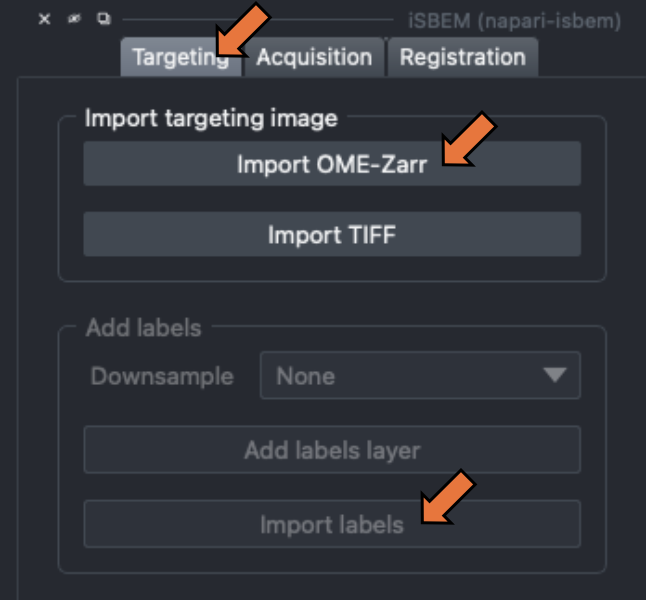
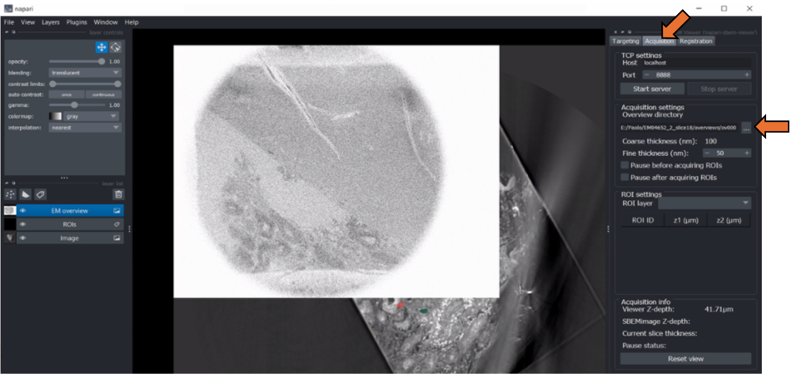
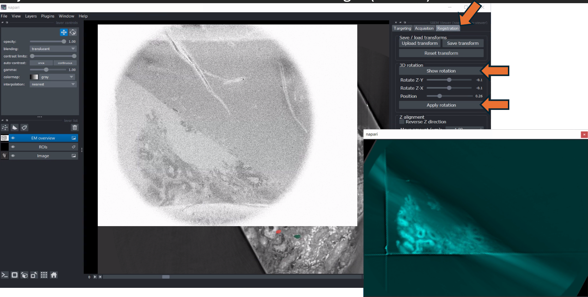
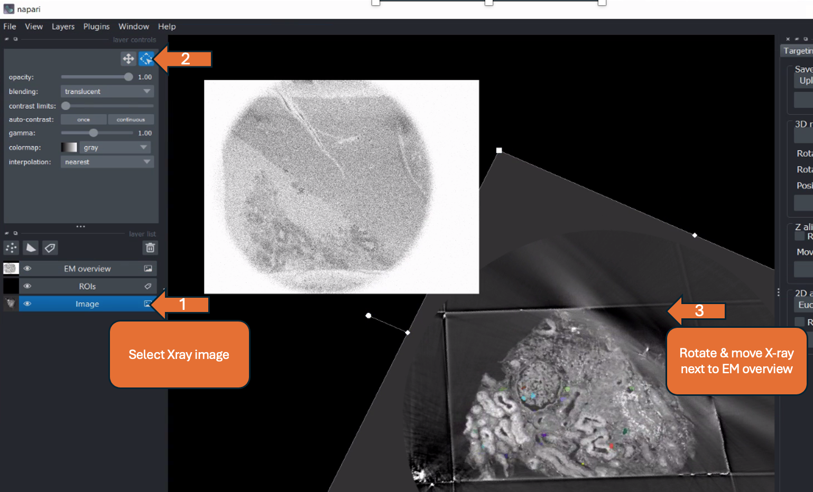
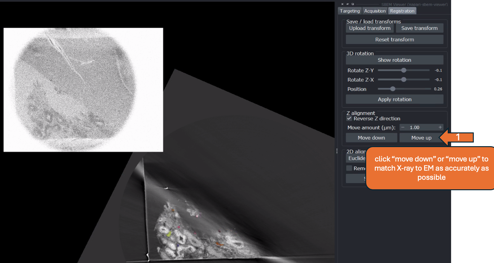
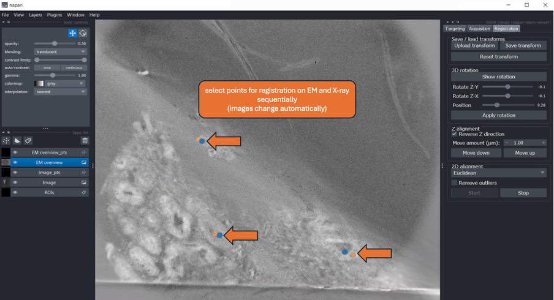
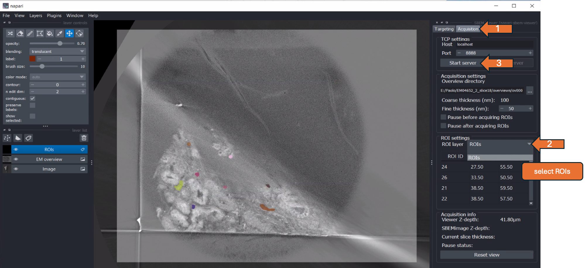
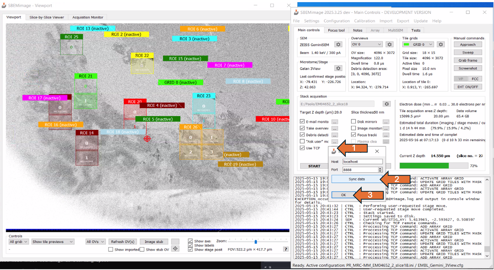
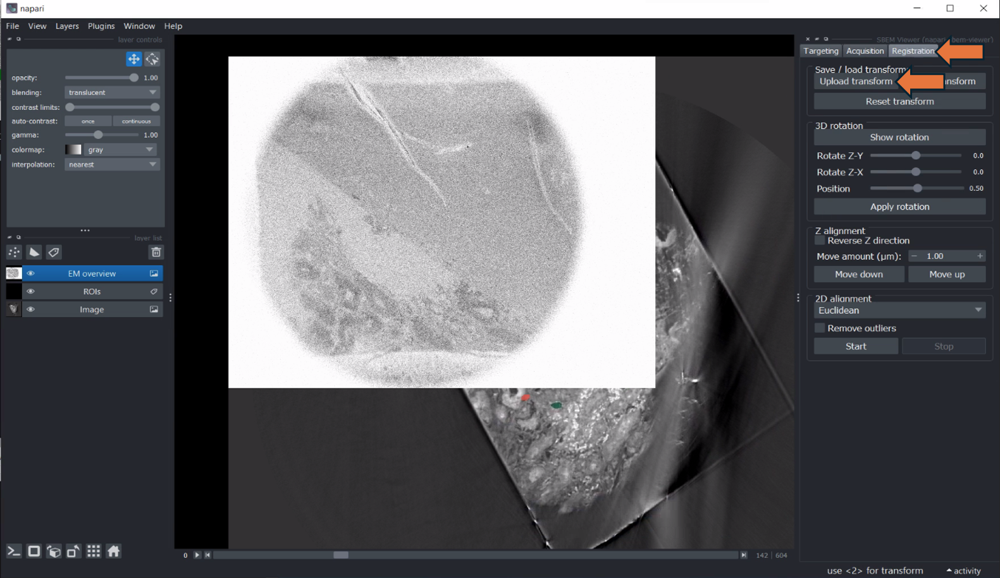

# iSBEM User Guide

Created: 20.05.2025, Yanneck Klenz

Edited: 20.04.2025, Fiona Young

This is a step-by-step user guide for a typical workflow using iSBEM. It describes the steps depicted in the [accompanying PDF](.assets/20250520_iSBEM_user_guide.pdf), which is referenced throughout ("slide x").

## Before "targeting"

- Approach block, when cutting, adjust the focus stigmators and wobbler
- Acquire Overview stack (Z = 1 µm) with a cutting thickness matching
  the settings for the actual acquisition (e.g. 100 µm)
- When importing X-ray as TIFF, check if the correct pixel size is saved
  in the image properties

## Import Datasets and preprocess ROIs \> "Targeting "

- Go to "Targeting" (top right menu)
- Import X-ray tomogram (OME-zarr) (slide 2) and adjust contrast, if
  needed (slide 3)
- Import labels (tiff) (slide 3)

- Dilate ROIs, create a buffer in all dimensions (slide 4)
- Run connected components and merge nearby labels to avoid double
  scanning (adjust merge tolerance based on tile size) =\> create
  individual ROIs
- Save adjusted ROIs by selecting "Export labels" (slide 7)

- Go to "acquisition" (top right menu) \> set EM overview directory \>
  move slider to the left until EM overview is visible (slide 8 -10)

## Rotation Transformation \> "Registration"

- Go to "Registration" \> show rotation =\> second napari window pops up
  with X-ray volume in cyan
- Drag and rotate the image (in the pop-up window) to match EM overview
  (slide 12)
- Adjust the position to match X-ray to EM overview (slide 12)
- Adjust the rotation in Z-X and Z-Y to match both images (slide 13)

- Close second window \> "apply rotation" \> message "Image rotated
  successfully!"

## 2D alignment \> "Registration"

- Select X-ray image (left menu) \> click "transform" bottom (top left)
  \> rotate and move X-ray image next to EM overview (slide 16)

- Tick reverse Z direction, if both datasets do **not** move in the same
  direction when changing the bottom slider (slide 17)
- Click "move up" or "move down" to match the display of the X-ray to
  the EM overview (slide 18) as accurately as possible
- can adjust "Move amount (µm)" to be more accurate
- If the overview is no longer depicted in the viewer, go to
  "Acquisition" \> "Reset view"

- Press "Start" under 2D alignment \> "point" layer for each modality
  should be added to the layer list on the left (slide 19)
- Select landmarks on EM and X-ray sequentially for 2D registration
  (images should switch automatically)
- Alignment is done in real-time \> after each point is added, evaluate
  the output

- Using the drop-down menu, select the desired transformation method
  (Euclidean, Similarity, Affine ) -\> output is updated immediately \>
  can compare results of different methods (slide 21)
- Satisfied with the result of 2D alignment \> press "stop" (slide 22)
- Save rotation and 2D alignment as ".txt" by clicking "Save transform"

## ROI selection \> "Acquisition"

- Go to the "Acquisition" tab (top right menu)
- In the drop-down menu under "ROI settings," select "ROIs" (slide 24)
- By double-clicking on "ROI ID" in the depicted table, the respective
  ROI is shown in the center of the napari viewer -\> can be used to
  check each ROI
- Press "Start server" (slide 24)

- Go to SBEMimage \> tick "Use TCP" \> click on the "..." symbol next to
  it
- In the popup window, select "Sync data" \> click "Ok" (slide 25)
- ROIs should appear in the SBEMimage Viewport \> check if positions are
  correct

- Adjust the focus and the stigmators
- In acquisition settings, define target depth (e.g. 10. µm) and cutting
  thickness (e.g. 100 nm) and start acquisition
- After the defined target depth is reached, re-register the two volumes
  in napari
- Continue with the acquisition

## Resuming from saved transformation

- Import X-ray and saved labels as usual
- Saved labels should be dilated and merged
- Load EM overview as described
- Go to "Registration" \> click "Upload transform" \> select the last
  saved transformation

- Should apply rotation and 2D transform on the X-ray
- Resume with "ROI selection" as described above (slide 24, 25)
