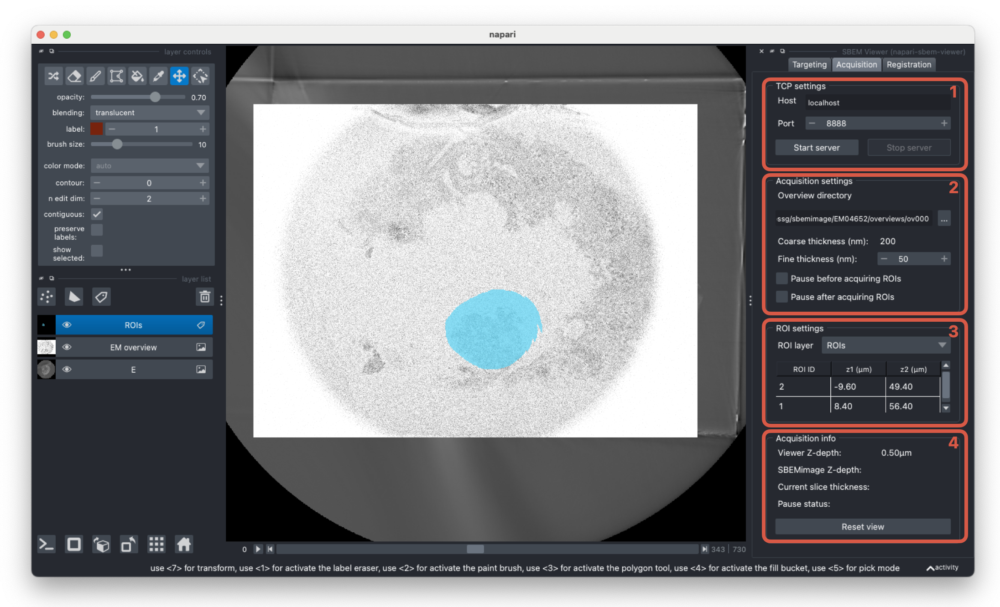

# Acquisition

The acquisition tab handles the integration with SBEMimage.

1. Start/stop the TCP server to enable communication between the plugin and SBEMimage. This is used together with the `Use TCP` option in SBEMimage to sync grids with the currently activated ROI layer.

2. Options for the current SBEMimage acquisition. Select the folder where overviews are saved from SBEMimage to view the sample in 3D as it is imaged. New images will automatically be added to the overviews layer as they are acquired. The coarse cutting thickness refers to the desired cutting thickness when no ROIs are being acquired and will be detected from the image metadata. The plugin will update the cutting thickness to the fine cutting thickness when an ROI is acquired, and is required to be a multiple of the coarse cutting thickness.

3. Once the ROI and targeting layers are registered with the overview layer, select the ROI labels layer from the dropdown. When an labels layer is selected and `Use TCP` is active in SBEMimage, the ROIs will automatically be acquired given the calculated coordinates.

4. Information for the current acquisition. You can view the current z-depth in the napari viewer along with the current state of the SBEMimage acquisition. The data is updated each time SBEMimage sends a request to the TCP server (either before imaging grids in each slice or when pressing the `Sync` button in the `Use TCP` options).
