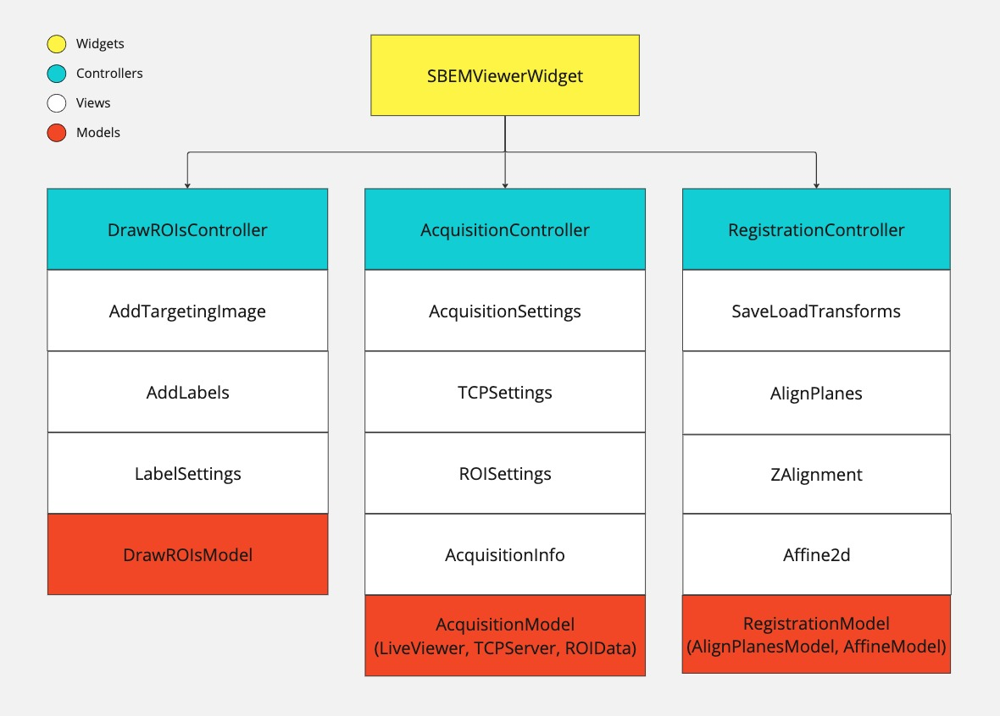

# File structure

The napari plugin is created using a Model View Controller (MVC) design which is reflected in the file structure. 
The main widget is located in `/_widgets/sbem_viewer.py` and includes the main Qt widget for the plugin. 
This widget initializes the Targeting, Acquisition and Registration tabs, where each tab has a separate model, view and controller class (see diagram below).
The views are located in the `/_views` directory, and include all the Qt widgets and layouts for the plugin. 
The models, found in `/_models`, handle the processing and interaction with the napari layers.
The controllers in `/_controllers` connect Qt events from the views to trigger model funtions, and events from the models to update the UI.




```
└── napari_isbem
    ├── __init__.py
    ├── _controllers
    │   ├── __init__.py
    │   ├── acquisition_controller.py
    │   ├── registration_controller.py
    │   └── targeting_controller.py
    ├── _models
    │   ├── __init__.py
    │   ...
    ├── _tests
    │   ├── __init__.py
    │   ...
    ├── _utils
    │   ├── general_utils.py
    │   ├── image_utils.py
    │   └── registration_utils.py
    ├── _views
    │   ├── __init__.py
    │   ├── acquisition
    │   │   ├── __init__.py
    │   │   ...
    │   ├── registration
    │   │   ├── __init__.py
    │   │   ...
    │   ├── targeting
    │   │   ├── __init__.py
    │   │   ...
    │   ├── acquisition_view.py
    │   ├── registration_view.py
    │   └── targeting_view.py
    ├── _widgets
    │   ├── __init__.py
    │   └── isbem.py
    └── napari.yaml

```
