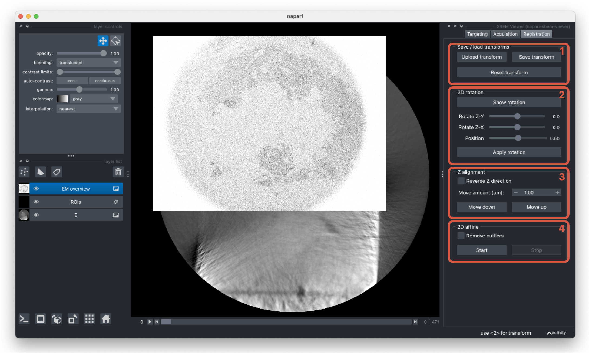

# Registration

The registration tab handles registering the targeting stack with the overview slices. Once the images are aligned, ROI coordinates can be calculated with respect to the SEM stage. When applying transforms, both the targeting layer and the current labels layer are transformed.

1. The current transform can be saved at any point. This will save both the rotation and the 2D transform as a single 4x4 transform matrix. Previously computed transforms in this format can also be loaded to apply to the current targeting and labels layers.

2. This widget rotates the target image if the z-axes of the images not aligned. Click `Show image` to show a 3D representation of the targeting image and adjust the `Rotate Z-Y` and `Rotate Z-X` sliders until the highlighted plane is aligned with the SEM stack in the main napari viewer. Once you are happy with the alignment, `Apply rotation` to reslice the targeting layer in the given orientation.

3. Once the z-axes of both images are aligned, the images can be aligned in the z dimension. Click `Move down` or `Move up` until the z slices are aligned and if required, the targeting stack can be flipped.

4. The last registration step is to apply a 2D transform to register the images in the x-y plane. After clicking `Start`, two points layers will be added to the viewer. First, select a point in the SEM layer, and then select the corresponding point in the targeting layer - the layers will automically select after picking a point. Once three sets of points are selected, an estimated 2D transform will be applied to the targeting layer. The transform will update as more points are selected. At any time, click `Stop` to remove the points layers. Selecting the `Remove outliers` option will recompute the transform after removing outliers with the RANSAC algorithm.
