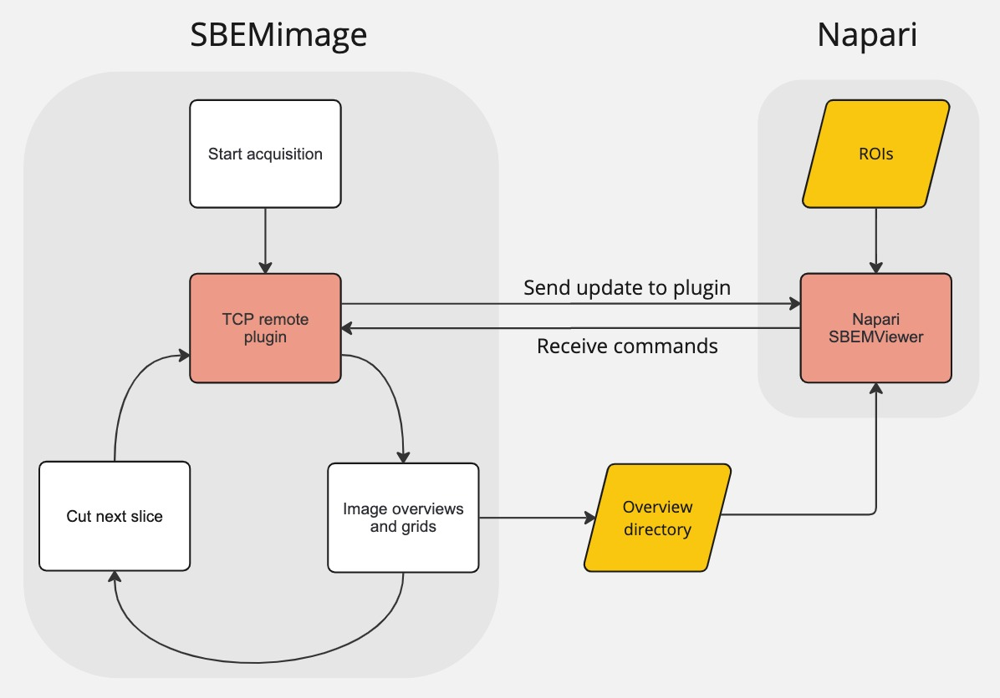

# SBEMimage integration

Communication with SBEMimage is handled in two different ways. 
The first uses the `LiveViewer` to stream images directly from the SBEMimage output. 
This only acts as one-way communication from SBEMimage to napari, and the transferred data is limited to the images and the image metadata.
Two-way communication is handled with `TCPServer` which receives TCP requests from SBEMimage and responds with commands to control the current acquisition.

## LiveViewer

The `init_images` method is called when an overview directory is selected in the napari plugin. This parses the selected directory and processes each tiff slice. 
The tiff slices are checked for consistent metadata, including a consistent z-spacing, and are added as a 3D image to the napari viewer with the correct scaling.
The `start_watching` method can then be called to watch the selected directory and add newly added slices to the initialized 3D stack.

## TCPServer

The `TCPServer` class runs a server that waits for TCP requests from SBEMimage. 
If the `Use TCP` function is activated in SBEMimage, a request is sent to the server after every new slice is imaged. 
The request includes information about the current state of SBEMimage, including pause status, the current z-height etc.
More information about the `Use TCP` feature can be seen in the SBEMimage [External tools](https://sbemimage.github.io/SBEMimage/external_tools/) documention.

The `TCPServer.run` method starts the server and awaits a request. When a request is received, it emits the `request_received` event and awaits for a response in the `response_queue`.
When a response has been added, it returns the data as a response to the original request.

In the `AquisitionModel` class, the `request_received` event is connected to the `AcquisitionModel.process_request` method. 
This adds commands to the response using e.g. `TCPServer.add_grid`, `TCPServer.pause_acquisition` etc, using the information from the current request.
Once the processing is finished, `TCPServer.send_response` is called which adds the commands to the `response_queue` and unblocks the thread running `TCPServer.run`.

