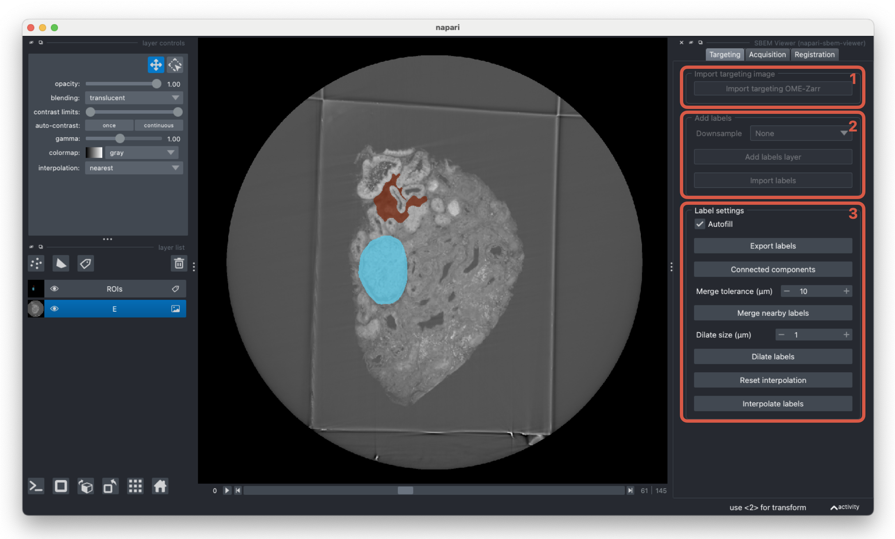

# Targeting

The targeting tab handles the selection of regions of interest within a targeting image.

1. Upload the targeting (XRM) file in OME Zarr format.

2. Create an new ROI layer or upload an existing masked image. The existing image should be aligned to the OME Zarr targeting image.

3. Settings to help edit ROIs. If `autofill` is active, labels will automatically be filled after drawing in the viewer. Use `Interpolate labels` to construct 3D ROIs after manually drawing 2D slices. The ROI settings are disabled after the targeting layer is rotated - in this case, reset the transformation before editing the labels.
